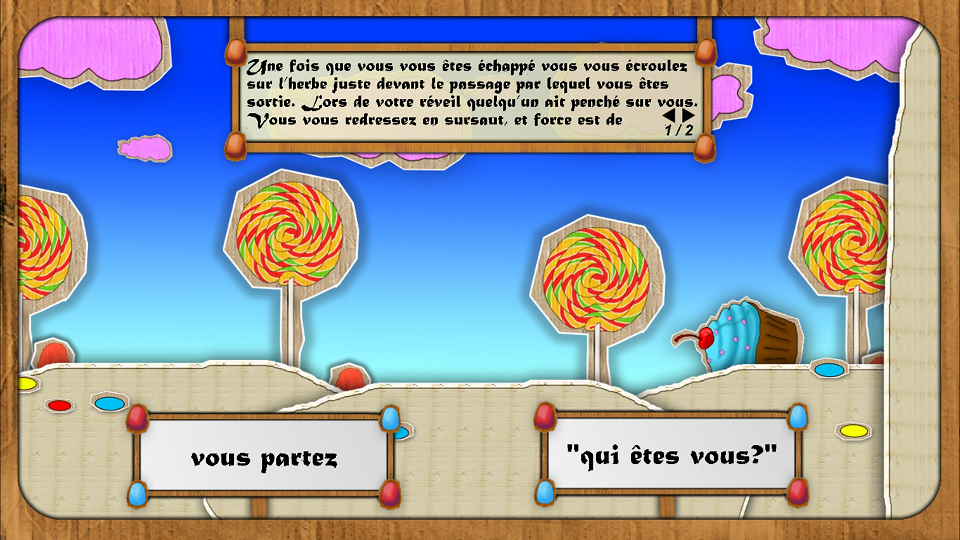
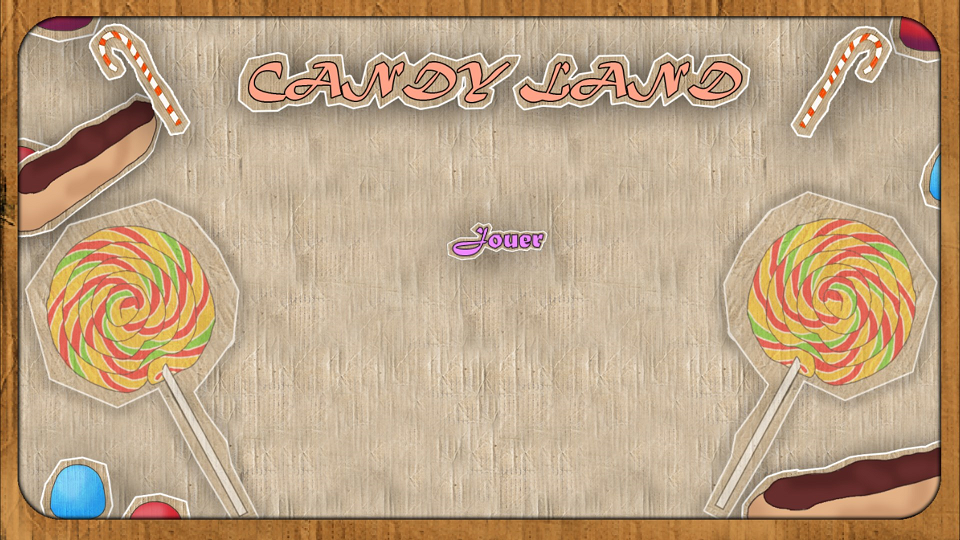
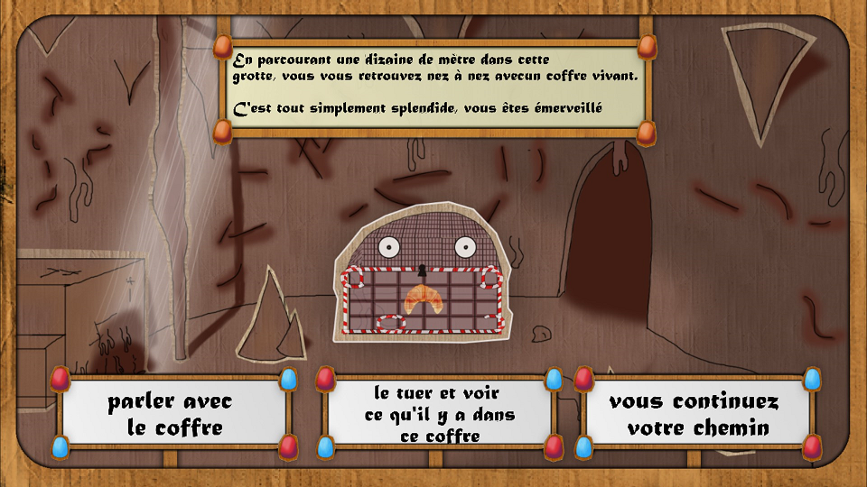
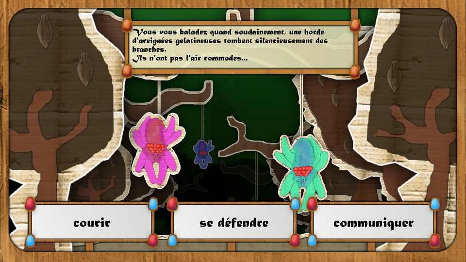

# Candy Land <a href="https://archer01.itch.io/candy-land">(Download game)</a>&nbsp;<a href="https://archer01-jeu-narratif-2d.hashnode.dev/">(Dev Blog)</a>

 
  &nbsp
  &nbsp
  &nbsp
  

---

## Résumé
Projet étudiant d'un jeu narratif en 2D dans un monde sucré tout en carton.

Ce git est là pour montrer la partie script du projet, tout le reste est enlevé pour des raisons de tailles acceptable sur Github, le projet unity complet est disponible ici : 
https://drive.google.com/file/d/1M3s-PtYUepUzRtfJutnpTq1o1mRIbg3u/view?usp=sharing

---

## Features
  * Jeu narratif à choix multiples avec quelques QTE et de nouveaux décors à découvrir.
  * Ambiance monde sucré en carton fait à l'aide de notre bon vieux Photoshop

---

## Crédit
Julien Guénard : Développeur Unity
Robin Luxereau : Artiste 2D

---

## Liens
  * <a href="https://www.youtube.com/channel/UCwxuydeEi6WyM-X6nsPs-8A">Youtube</a>
  * <a href="https://archer01.itch.io/">Itch.io</a>
  * <a href="https://hashnode.com/@Archer01">Hashnode (Dev Blog)</a>
  * <a href="https://www.linkedin.com/in/julienguenard/">Linkedin</a>
  * <a href="https://twitter.com/julien_guenard">Twitter</a>

